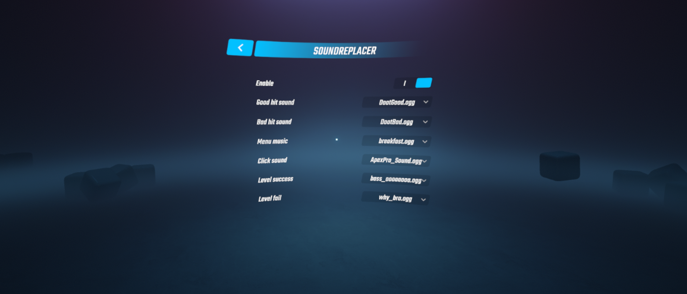
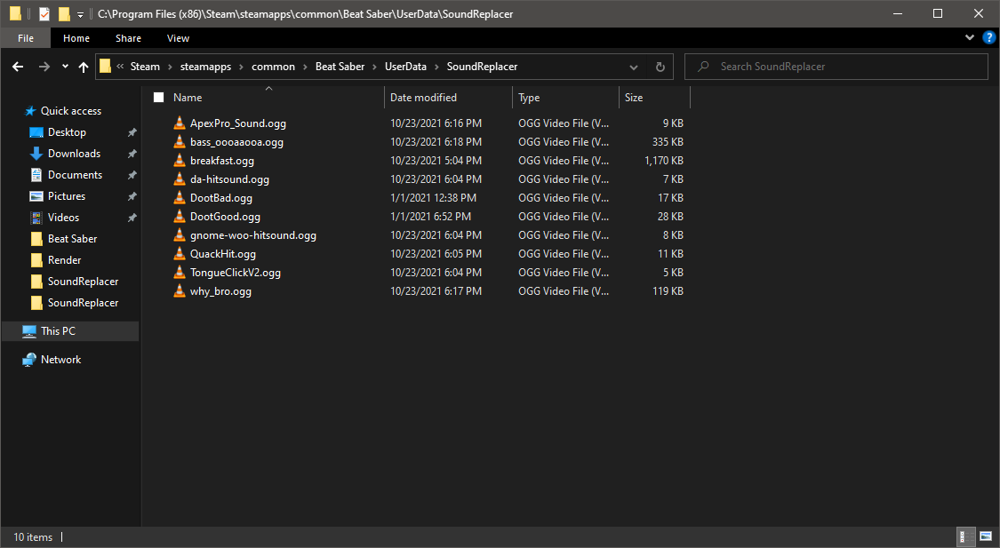
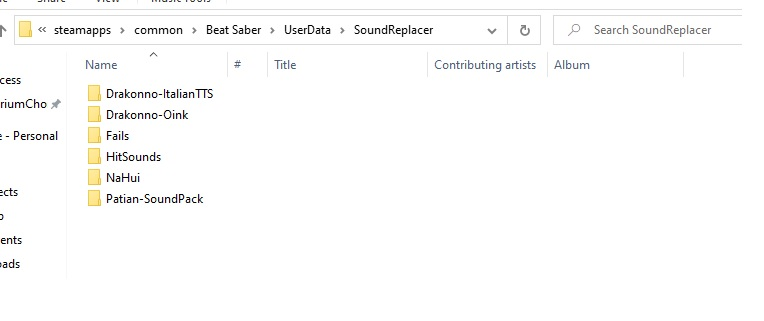
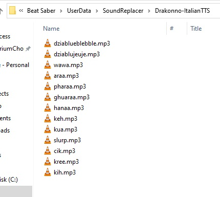

# 🔊 SoundReplacer
A BSIPA compatible mod that can change following in-game sounds:
 - Good/bad hit sound
 - Menu music
 - Menu clicks
 - Level cleared music
 - Level failed music

## Installation
Make sure that you have core mods installed with [ModAssistant](https://github.com/Assistant/ModAssistant) (BSIPA, BSML). Go to the [releases page](https://github.com/SamuelTulach/SoundReplacer/releases) and download the latest build (or build compatible with your Beat Saber version). Extract the zip file and move the DLL file into plugins folder located in Beat Saber install directory.

## Usage
First, you will need to find sounds that you want to use. They have to be in OGG/MPEG/WAV format. Please note that certain sounds should have offset, otherwise it might seem like the sound is played before the action happens. To download ready to use sounds, check out [BSMG discord's](https://discord.gg/beatsabermods) #game-sounds section.

Once you have sounds that you want to use, simply move them to Beat Saber install directory -> UserData -> SoundReplacer (should be created automatically if you run the game with mod once, do not put them within subfolders). After you have done so, (re)start the game and choose which sounds you want to use in the in-game menu. If you are unsure how the folder structure should look, check out the screenshot bellow.

## Advanced usage
With new version, you can also group sounds in folders. To do that, just create a folder under  Beat Saber install directory -> UserData -> SoundReplacer -> YourNewFolder, and put sound files there.

Folders can't be nested, so only one level of depth is supported. 

Then in game, you can select if you want to use default SoundReplacer folder, or one of the other folders.

## Random
With new version, you can also select additionally a Random option. This will play a Random song from a selected directory. 

## Issues/constributing
If you find any issue or you have a suggestion, you can use GitHub issues. If you want to contribute, this repo is accepting pull requests.